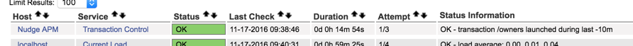
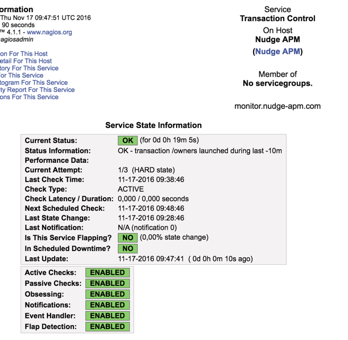
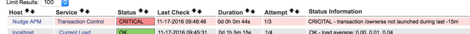
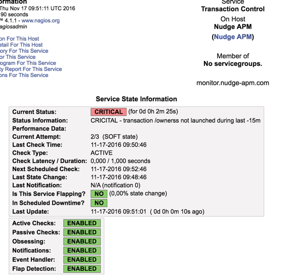

# transaction_execution_control

This script checks, in an application monitored by [Nudge APM](https://www.nudge-apm.com), if a transaction has been executed recently.

Use case : check the execution of a regularly planified job.

# Installation

There are several ways to configure this plugins and the best way depends on your Nagios install and configuration.
This is an example.

* First, you have to download [the script](transaction_execution_control.sh) and add it to your Nagios plugins directory (you will have to replace the `/path/to/nagios/plugins` by this path in the next step).

* Then, you add a new command to your Nagios `commands.cfg` file :
```
define command {
    command_name check_job
    command_line /path/to/nagios/plugins/transaction_execution_control.sh $ARG1$ $ARG2$ $ARG3$ $ARG4$ $ARG5$ $ARG6$
}
```

* Next, you create a new server configuration file (in your Nagios `servers` directory) with this content:
```
define host {
    use     generic-host
    host_name   Nudge APM
    alias       Nudge APM
    address     monitor.nudge-apm.com
    max_check_attempts 10
}
define service {
    use                 generic-service
    host_name           Nudge APM
    service_description Transaction Control
    check_command       check_job![login]![pwd]![app_id]![transaction]![warn_threshold]![crit_threshold]
}
```
You have to replace parameters of the `check_command` line.
  - The `app_id` parameter is the Nudge APM id of the application that runs the job. This id can be collected from REST API in `/api/apps` query.
  - The `transaction` parameter is the transaction name of the job to be controlled.


* Finally, you restart Nagios service to enable the control.

# Screenshots

* Services dashboard with successful control:<br>
<kbd></kbd>

* Service state with successful control:<br>
<kbd></kbd>

* Services dashboard with failed control:<br>
<kbd></kbd>

* Service state with failed control:<br>
<kbd></kbd>
